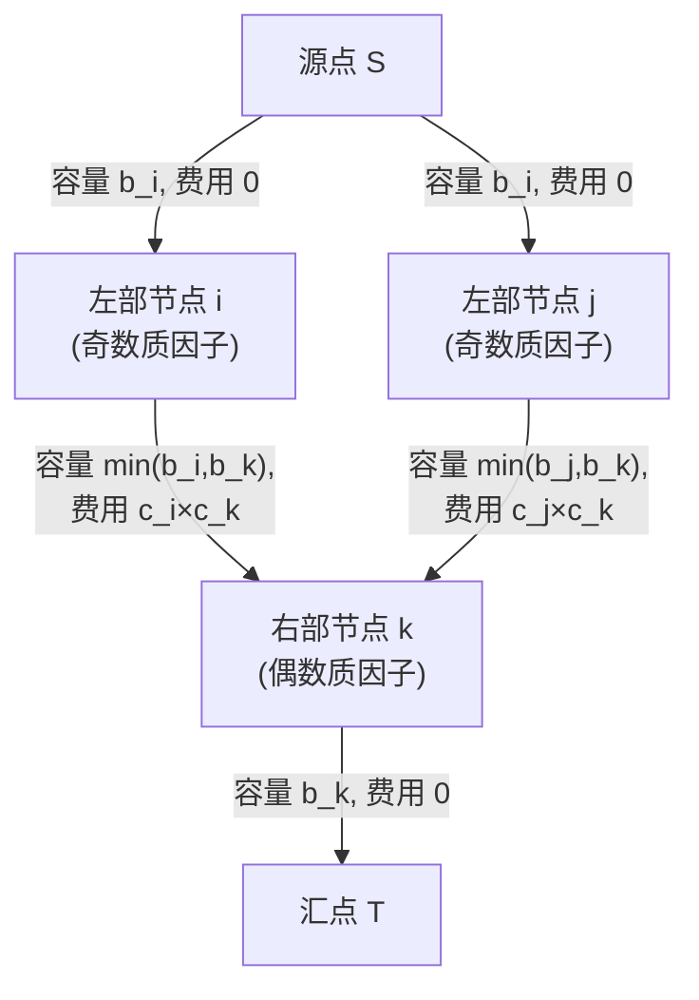

## 读题

$n$ 个城市，每个城市有 $b_i$ 单位粮食和每单位价值 $c_i$。若两个城市 $i,j$ 满足 $\max(a_i/a_j, a_j/a_i)$ 是质数，则可以配对。每配对一个单位的 $i$ 和 $j$，获得价值 $c_i \times c_j$。每个城市的粮食有限，求最大总价值。

题目绕了一大段：$a_i$ 是 $i$ 城市的"品质"，两个城市能配对的条件是比值是质数。

## 从条件到结构

$\max(a_i/a_j, a_j/a_i)$ 是质数意味着什么？

假设 $a_i > a_j$，那么 $a_i / a_j = p$（质数），即 $a_i = a_j \times p$。

换句话说：**一个数是另一个数的质数倍**。

进一步：质数倍等价于"质因子个数相差恰好 1"。

证明很简单：$a_i$ 的质因子分解是 $\prod q_k^{e_k}$，$a_j$ 的质因子分解是 $\prod q_k^{f_k}$。比值是质数意味着只有一个质因子的指数差为 1，其余指数相同。所以质因子总个数差恰好为 1。


## 二分图

质因子个数差 1 $\rightarrow$ 奇数个数和偶数个数之间才有边。

这天然就是一张二分图：
- 左部：质因子个数为奇数的城市
- 右部：质因子个数为偶数的城市

奇数侧和偶数侧之间连边，容量 $\min(b_i, b_j)$，费用 $c_i \times c_j$。

## 费用流建模

标准的二分图最大费用匹配，但每个节点有容量限制 $b_i$。

建图方式：
- 源点 $S$ 连向所有左部节点，容量 $b_i$，费用 0
- 所有右部节点连向汇点 $T$，容量 $b_i$，费用 0
- 左部 $i$ 到右部 $j$ 连边，容量 $\min(b_i, b_j)$，费用 $c_i \times c_j$

求最大费用最大流。

但这里有个约束：总价值不能为负。因为费用流求的是"最大费用"，如果费用为负的路径被增广，总价值会下降。所以我们在累计费用 `cumcost` 时，如果增广后变为负数，就要回退。



## SPFA 实现

费用有正有负，直接用 SPFA 求最短路（实际上是找费用最大的增广路，把费用取反求最短路）。

```cpp
while (true) {
    memset(dist, 0x3f, sizeof(dist));
    dist[S] = 0;
    // SPFA
    if (dist[T] == 0x3f3f3f3f) break;
    
    // 沿最短路增广
    int push = augment();
    cumcost += push * (-dist[T]); // dist 取反了
    
    if (cumcost < 0) {
        cumcost -= push * (-dist[T]); // 回退
        break;
    }
}
```

## 调试记录


1. **WA：重复加边**。二重循环 `(i,j)` 和 `(j,i)` 都加了边，导致每条边出现两次，容量翻倍。修复：只从奇数侧向偶数侧连边，单向。

2. **WA：提前退出**。增广后 `cumcost` 为 0 时直接 `break`，漏掉了后续可能还有正费用的增广路。修复：只在 `cumcost < 0` 时回退并退出，`cumcost == 0` 继续增广。

3. **最终 AC，100 分。**

## 总结

这道题的核心是从"比值是质数"看出"质因子个数差 1"，再看出"奇偶二分"。建模本身是标准的费用流，难点在于约束处理（不能为负）和建图细节（单向连边）。
